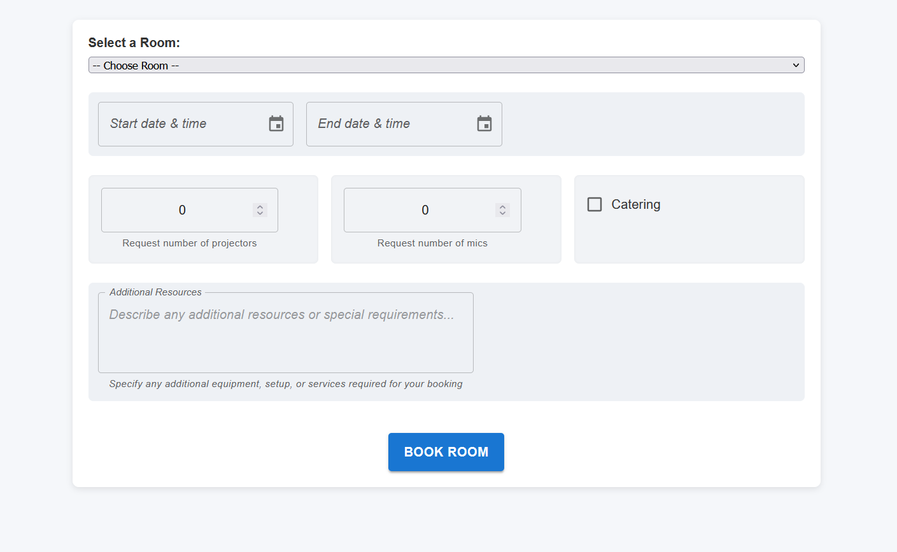
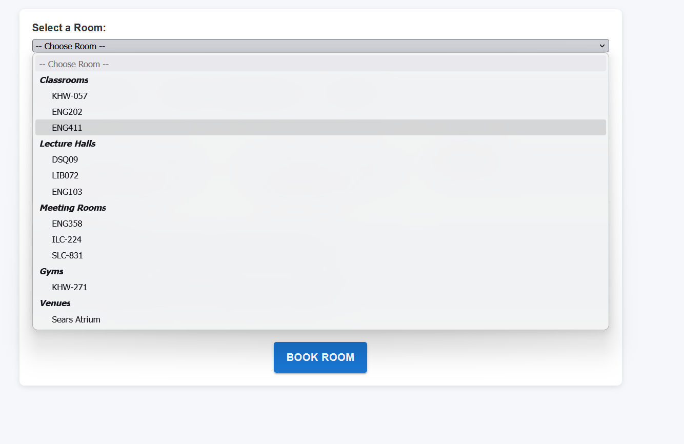
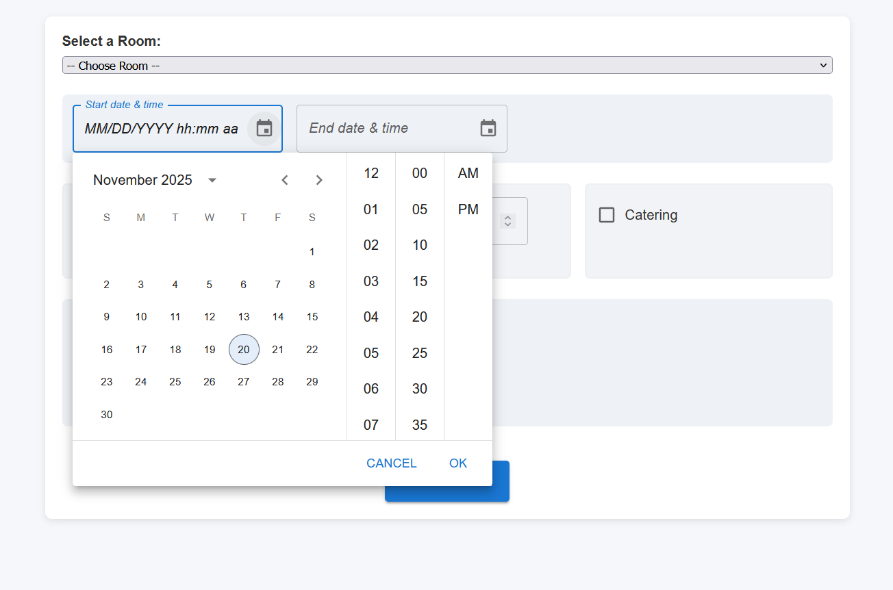
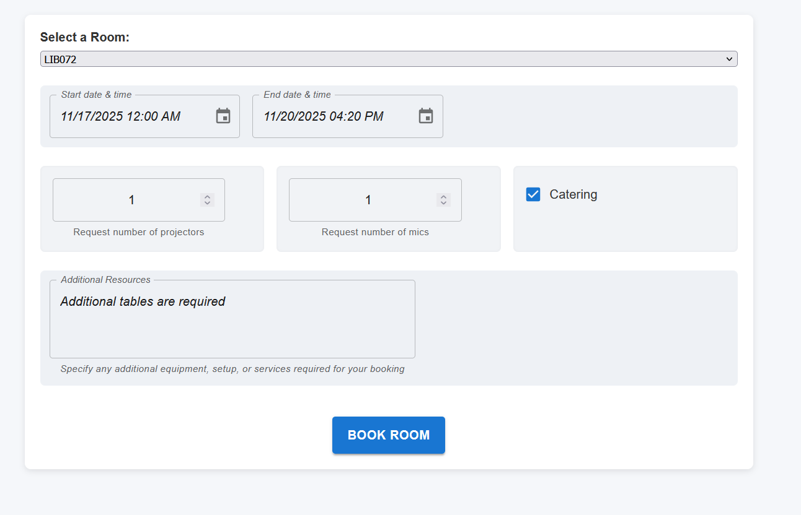
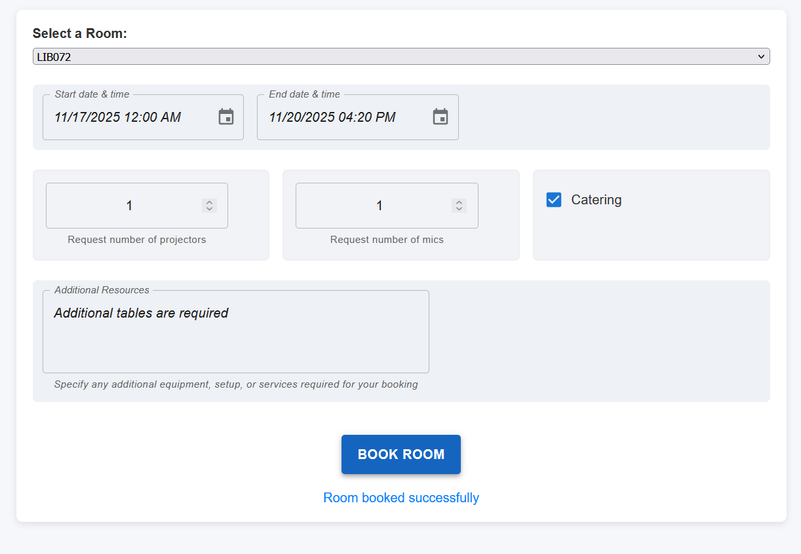

# User Documentation
Welcome to the final project for CPS714 Section 4 Group 1. 
Below will detail the functions of our app and how to use it.
## Room Booking App

To work with our simple application, you must fill out the form. 
The request will be stored on our database and a request will be sent to the
rooms manager whom will fulfil or deny the booking request.

## Select the room

Click on the room drop down menu to select a room to be booked.

## Select the start and end date for your booking

Now you must select the starting and ending date of your booking. You can type in the date yourself 
or choose from the calendar dropdown.

## Fill out your provisions

To be supplied with what you need for your event, please fill out the remaining fields with the
amount of projectors, mics, catering, or anything else you need.

## Book your room

Now click **BOOK ROOM** and your room booking request will be inquired!