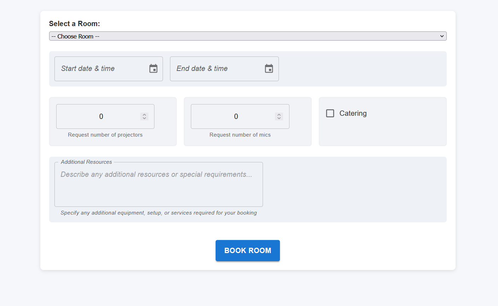
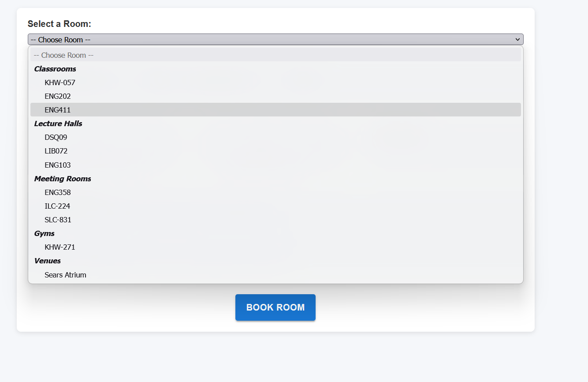
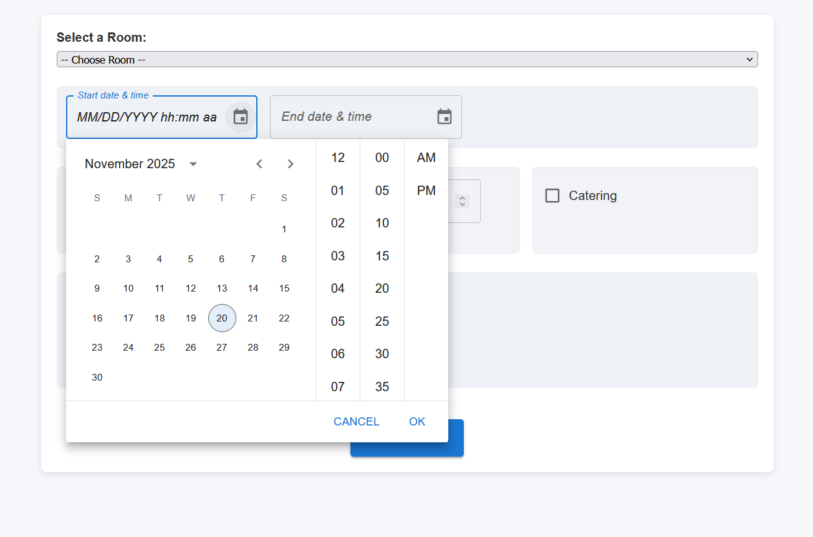
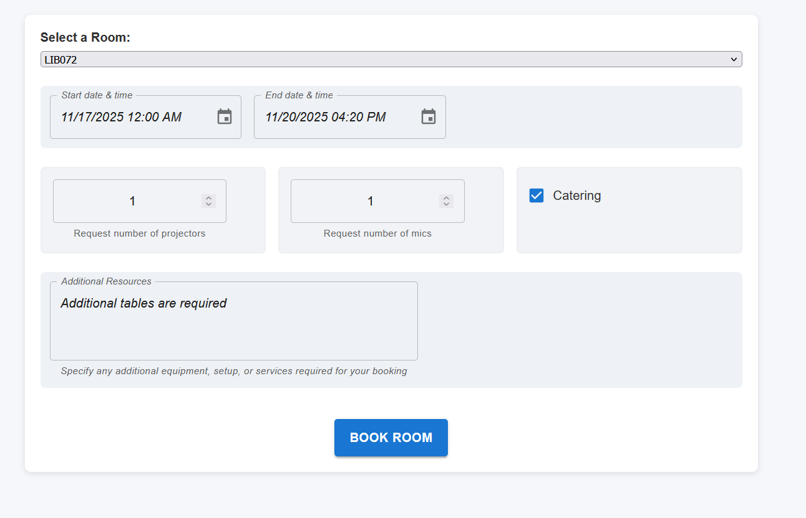
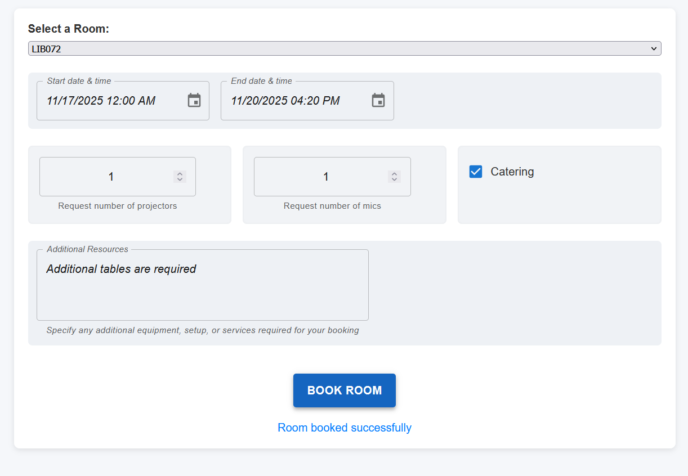

# User Documentation
Welcome to the final project for CPS714 Section 4 Group 1. 
Below will detail the functions of our app and how to use it.

## Table of Contents
* [Prerequisites](#prerequisites)
* [Installation](#installation)
* [Running the Application](#running-the-application)
* [Feature Use](#feature-use)
* [Troubleshooting](#troubleshooting-&-FAQ)

## Prerequisites
* **node.js**
 You may can install it from https://nodejs.org/
   
   Verify Node.js is installed by typing in terminal `npm -v`  
   
    

(<a href="#readme-top">back to top</a>)

## Installation
### 1. Clone the repo
    You have two options to clone the repository:
  * You can use the command 
  `git clone https://github.com/icejan/CPS714-Section4.git`

  * Using github desktop by clicking add > clone > enter URL of this repo (https://github.com/icejan/CPS714-Section4)
### 2. Install frontend libraries
* Go to the frontend directory and enter the command on terminal 
`npm install `

### 3. Install backend libraries
* Go to the backend directory and enter the command on terminal 
`npm install `

(<a href="#readme-top">back to top</a>)

## Running the Application
### 1. Start the backend server
* Go to the backend directory and enter the command on terminal
`npm run dev `
* Verify it runs on port: 5000
### 1. Start the frontend 
* Go to the backend directory and enter the command on terminal
`npm start ` 
* Verify it runs on port: 3000

(<a href="#readme-top">back to top</a>)

# Feature Use

To work with our simple application, you must fill out the form. 
The request will be stored on our database and a request will be sent to the
rooms manager whom will fulfil or deny the booking request.

## Select the room

Click on the room drop down menu to select a room to be booked.

## Select the start and end date for your booking

Now you must select the starting and ending date of your booking. You can type in the date yourself 
or choose from the calendar dropdown.

## Fill out your provisions

To be supplied with what you need for your event, please fill out the remaining fields with the
amount of projectors, mics, catering, or anything else you need.

## Book your room

Now click **BOOK ROOM** and your room booking request will be inquired!

(<a href="#readme-top">back to top</a>)

# Troubleshooting & FAQ
* Q1: The browser is blank after `npm start`  
    **Cause:** the frontend server may not be running properly.
    1. Clear your browser cache or try an incognito/private window.
    2. Confirm the server is running at http://localhost:3000.
* Q2: Book Room button is not working and shows "Error connecting to backend server"
    **Cause:** the backend server may not be running properly.
    1. Clear your browser cache or try an incognito/private window.
    2. Disable ad-blocks or third party extensions in your browser
    2. Confirm the backend server is running at http://localhost:5000.
